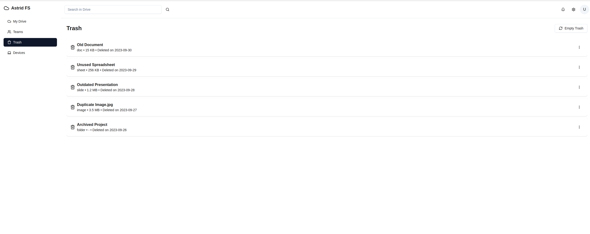

# Astrid

File storage and syncing service

## Core Features

-   [ ] Feature 1: Store files
-   [ ] Feature 2: Sync files between computers
-   [ ] Feature 3: Share files between team members
-   [ ] Feature 4: Create different permission levels for different files

## Current Status

[Note] Heavy inspiration on UI from Google Drive

#### Home Page

This is the page to see all the files you are working with. All files stored here are available and replicated on SeaweedFS object store.


#### Team Page

This is where a user can see their teams. A team consists of members and files.


#### Devices Page

This is where a user can see their devices they have connected to thei file system. Each device should be updated when it receives notice of a change in a file. This is to ensure that all files are synced between YOUR devices.


#### Trash Page

A trash page for all unneeded files.



## To run

Frontend

```bash
cd astrid-fe

pnpm install

pnpm dev
```

Backend

Note: You will need to make a copy of the .env.local file and place your desired variables before running docker-compose

```bash
cd astrid-be

cd scripts

docker-compose -f services-compose.yml -p astrid up -d

cd ../

make all
```
